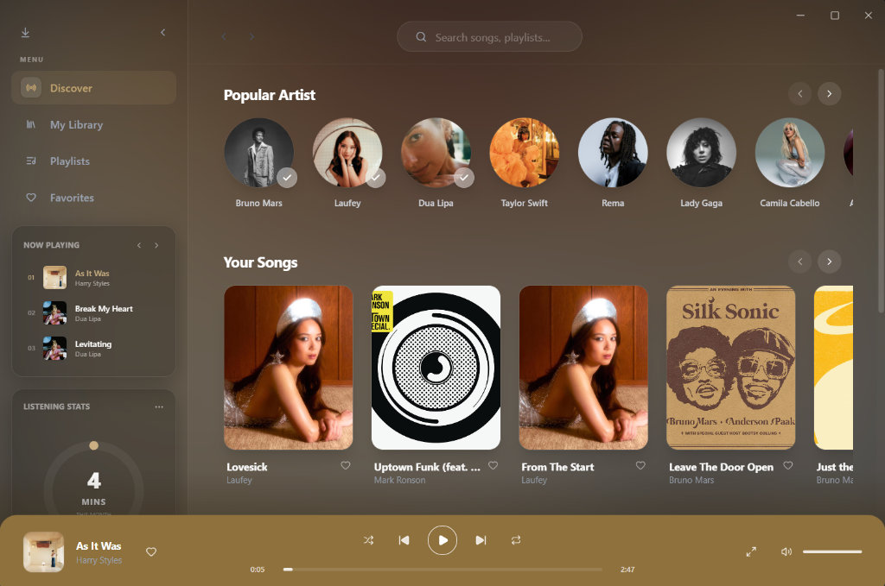

<div align="center">

# 🎵 Stero

**A feature-rich, beautiful Desktop Music Player built with React, Vite, Electron, and Tailwind CSS.**

[](https://reactjs.org/)
[](https://www.electronjs.org/)
[](https://tailwindcss.com/)
[](https://opensource.org/licenses/MIT)

Play local audio files, manage playlists, and download high-quality music directly from YouTube Music with zero playback latency.

</div>

---

## 📥 Download & Install

**The easiest way to get started is to download the pre-built Setup file for Windows:**

### [🚀 Download Stero Setup (Windows)](https://github.com/saiyedarsh-hello/Stero/releases/latest)

> **Note to Developer:** Please upload the `Stero Setup 1.0.0.exe` file from your `dist-desktop` folder to the **[GitHub Releases](https://github.com/saiyedarsh-hello/Stero/releases)** page so users can download it using the link above!

---

## 📸 Screenshots

<p align="center">
  
  
</p>

---

## ✨ Features

- 🎨 **Modern & Beautiful UI**: Built with React and beautifully styled using Tailwind CSS.
- 🗂️ **Local Library Management**: Automatically organizes your music, reads ID3 metadata, and manages playlists using a blazing fast local SQLite database.
- ☁️ **Music Downloader**: Seamlessly integrated with YouTube Music to search, download, and extract high-quality audio directly into your library.
- ⚡ **Zero Latency Playback**: Custom protocols and in-memory caching eliminate buffering for both local and streamed audio.
- 🖥️ **Cross-Platform**: Powered by Electron, allowing future support for macOS and Linux.

---

## 🛠️ Tech Stack

| Category | Technologies |
| :--- | :--- |
| **Frontend** | React (v19), Vite, Tailwind CSS, Zustand |
| **Desktop/Backend** | Electron, Node.js |
| **Database** | `better-sqlite3` |
| **Audio & Downloads** | `youtube-dl-exec`, `ytmusic-api`, `ffmpeg-static`, `music-metadata` |
| **Packaging** | `electron-builder`, `tsup` |

---

## 🚀 Latency & Performance Optimizations

To ensure sub-second startup times and eliminate audio playback delay, Stero implements advanced latency optimizations:

* **Manual Range-Request Protocol (`media://`)**: The backend handles byte-range requests manually by serving files via `fs.createReadStream` and responding with `206 Partial Content`. This forces Chromium to stream audio fragments on-demand, allowing local files to play instantly with zero buffering lag.
* **Hover Pre-Resolution**: Moving the cursor over a track card or list row starts resolving the YouTube stream URL in the background. Since the hover gesture precedes the click, the network lookup is completed early, making playback feel immediate.
* **In-Memory Streaming Cache**: Resolved YouTube streaming URLs are cached in-memory for 3 hours. Skipping back or re-triggering a song retrieves the direct media URL in under 5ms.
* **Queue Preloading**: While a song is playing, the queue preloads the next song's direct stream link asynchronously.
* **Asynchronous DB Engine**: JSON database persistence writes are performed asynchronously to prevent disk write tasks from blocking the Electron main thread.

---

## 💻 Development Setup

Want to contribute or build from source? Follow these steps:

### Prerequisites
- **Node.js** (v18 or higher)
- **Git**

### 1. Clone the Repository
```bash
git clone https://github.com/saiyedarsh-hello/Stero.git
cd Stero
```

### 2. Install Dependencies
Since this project uses native modules like `better-sqlite3`, it will compile the binaries during installation.

```bash
npm install
```
> *Windows Users: If you run into issues installing `better-sqlite3`, ensure you have Python and Visual Studio Build Tools installed, or run `npm install --global windows-build-tools`.*

### 3. Run in Development Mode
Start the application with Hot-Module Replacement (HMR) enabled:

```bash
npm run dev
```

### 4. Build for Production
To package the app into a standalone executable:

```bash
# Build the React and Electron source files
npm run build

# Package the application for Windows
npm run dist
```
*The packaged executables will be available in the `dist-desktop/` directory.*

---

## 📄 License

This project is intended for personal use. Ensure you comply with YouTube's Terms of Service when using the downloading features.
